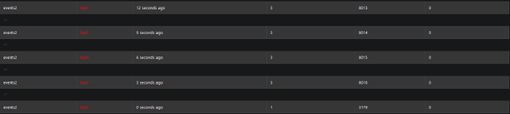
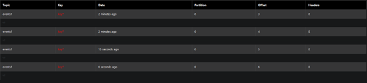

# Lab 4

The solution for the homework can be found in `Java_Project/app/src/main/java/l4/App.java`.

The code provided creates a consumer that watches for messages coming on `events2` topic, filters only the messages with `v7` as value and send them on `event1` as a producer.

I also checked the topics with AKHQ tool on `http://localhost:8180/ui` and I looked for messages coming on the 2 topics using the following commands:

- http://localhost:8180/ui/docker-kafka-server/tail?topicId=events1 for `event1`
- http://localhost:8180/ui/docker-kafka-server/tail?topicId=events2 for `event2`

## Testing

For testing I started an `ExampleProducer`, described in Lab 3 and the messages were forwarded on `topic2`. An image from AKHQ tool is the next one and shows the messages received on topic2:

After that, I started the solution for homework and you can see on `topic1` that only the messages with `v7` as value are received:

