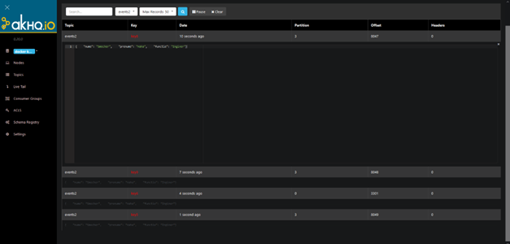
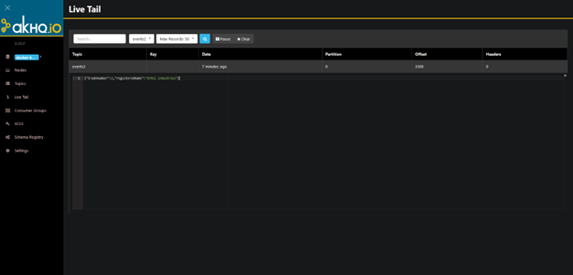

# Lab 5 Homework

## Exercise 1

`Use SimpleExampleProducer.java class. Send an json file on topic events2`

I created a json file called `test.json`, which is placed along with the other Java files. The code for `JsonProducer` reads the file as string every time a new message is sent on `events2` topic and sends it on this topic. I checked the `AKHQ` tool on `events2` topic and the json file content was sent correctly as you can see in the next picture:

## Exercise 2

`Use SimpleExampleProducer.java class or JsonProducer.java. Send a Java object as payload.`

Java class called `CompanyProducer` is created based on `SimpleExampleProducer` class and I used to send only one message on `events2` topic. Inside the class I created an object of type `JCompany` and I used it as payload. I called it `JCompany` instead of `Company` because I will create a class `Company` later on this project and I don't want to have conflicts. The proof that the code actually worked can be seen in the next picture, an image from `AKHQ` tool:

## Exercise 3

`Create a Producer that uses an avro schema for Company class.`

I generated the `Company` class using the avro schema which is placed in `Java_Project/app/src/main/avro/AvroCompany.avsc`.
The class was generated in `Java_Project/app/build/generated-main-avro-java/l4/Company.java`.
I used this new class in `CompanyProducer` and I got the same result as above for exercise 2.

## Exercise 4

`Create a Consumer that uses an avro schema for Company class.`

I created `CompanyConsumer` class starting from `SimpleExampleConsumer` as a model. I needed to change the consumer to accept `Company` objects as values and I also added a `toString` method in the `Company.java`  to be pretty printed on the screen.

For testing, I started a `CompanyConsumer` to collect the messages on `events2` topic and a `CompanyProducer` to send messaged on `events2` topic. In the logs of `CompanyConsumer` I've seen a log related to the transmitted message with the right information about the Java object

## Additional questions

`Why is needed the class empty constructor? `

When you send or receive objects on Kafka topics, these objects need to be serialized and deserialized. For deserialization process involves creating an empty instance and populating it with the right information received on the topic. During this process, the Kafka consumer knows what value should put on each objects' fiels.

`Why are the Getters needed?`

The Getters are needed during the same part as above, but this time for serialization. When you serialize an object, you need to take the value from each field using a getter and place it in the right place in the JSON serialized object that will be transmitted on the topic.
